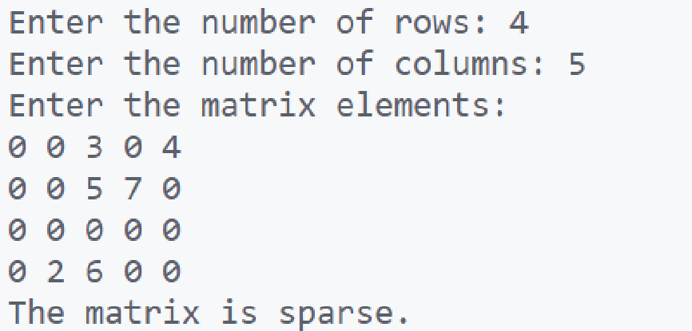

\setcounter{page}{36}

# PRACTICAL 18 -

**Objective** - The name roll number and marks of 10 students are stored in an array named marks. Write a program to find the Name of first, second and third rank holder.

### CODE - 

```c
#include <stdio.h>
#include <stdbool.h>
#include <stdlib.h> // For malloc and free

// Function to check if a 2D matrix is sparse.
// Takes the matrix, number of rows, and number of columns as input.
bool isSparseMatrix(int **matrix, int rows, int cols) {
    int size = rows * cols; // Total number of elements in the matrix.
    int zeroCount = 0;      // Count of zero elements.

    // Iterate through the matrix and count zero elements.
    for (int i = 0; i < rows; i++) {
        for (int j = 0; j < cols; j++) {
            if (matrix[i][j] == 0) {
                zeroCount++;
            }
        }
    }

    // A matrix is sparse if the number of zero elements is greater than half of the total elements.
    if (zeroCount > (size / 2)) {
        return true; // Matrix is sparse.
    } else {
        return false; // Matrix is not sparse.
    }
}

int main() {
    int rows = 4;
    int cols = 5;

    // Dynamically allocate the matrix.
    int **matrix = (int **)malloc(rows * sizeof(int *));
    if (matrix == NULL) {
        printf("Memory allocation failed.\n");
        return 1; // Exit with an error code.
    }

    for (int i = 0; i < rows; i++) {
        matrix[i] = (int *)malloc(cols * sizeof(int));
        if (matrix[i] == NULL) {
            printf("Memory allocation failed.\n");
            // Free any already allocated memory
            for(int k = 0; k < i ; k++){
                free(matrix[k]);
            }
            free(matrix);
            return 1;
        }
    }

    // Initialize the matrix with sample data.
    int sampleMatrix[4][5] = {
        {0, 0, 3, 0, 4},
        {0, 0, 5, 7, 0},
        {0, 0, 0, 0, 0},
        {0, 2, 6, 0, 0}
    };

    // Copy sample data into the dynamically allocated matrix.
    for (int i = 0; i < rows; i++) {
        for (int j = 0; j < cols; j++) {
            matrix[i][j] = sampleMatrix[i][j];
        }
    }

    // Check if the matrix is sparse and print the result.
    if (isSparseMatrix(matrix, rows, cols)) {
        printf("The matrix is sparse.\n");
    } else {
        printf("The matrix is not sparse.\n");
    }

    // Free dynamically allocated memory.
    for (int i = 0; i < rows; i++) {
        free(matrix[i]);
    }
    free(matrix);

    return 0;
}
```

### OUTPUT -   

