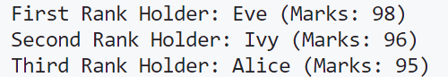

\setcounter{page}{39}

# PRACTICAL 19 -

**Objective** - The name roll number and marks of 10 students are stored in an array named marks. Write a program to find the Name of first, second and third rank holder.

### CODE - 

```c
#include <stdio.h>
#include <string.h>

// Structure to store student information
struct Student {
    char name[50];
    int rollNumber;
    int marks;
};

// Function to find the index of the student with the highest marks
int findHighestMarksIndex(struct Student arr[], int size, int excludeIndex1, int excludeIndex2) {
    int highestMarks = -1;
    int highestIndex = -1;
    for (int i = 0; i < size; i++) {
        if (i != excludeIndex1 && i != excludeIndex2 && arr[i].marks > highestMarks) {
            highestMarks = arr[i].marks;
            highestIndex = i;
        }
    }
    return highestIndex;
}

int main() {
    // Array to store information of 10 students
    struct Student marks[10] = {
        {"Alice", 101, 95},
        {"Bob", 102, 88},
        {"Charlie", 103, 92},
        {"David", 104, 78},
        {"Eve", 105, 98},
        {"Frank", 106, 85},
        {"Grace", 107, 90},
        {"Henry", 108, 75},
        {"Ivy", 109, 96},
        {"Jack", 110, 89}
    };

    // Find the index of the first rank holder
    int firstRankIndex = findHighestMarksIndex(marks, 10, -1, -1);

    // Find the index of the second rank holder, excluding the first rank holder
    int secondRankIndex = findHighestMarksIndex(marks, 10, firstRankIndex, -1);

    // Find the index of the third rank holder, excluding the first and second rank holders
    int thirdRankIndex = findHighestMarksIndex(marks, 10, firstRankIndex, secondRankIndex);

    // Print the names of the top three rank holders
    printf("First Rank Holder: %s (Marks: %d)\n", marks[firstRankIndex].name, marks[firstRankIndex].marks);
    printf("Second Rank Holder: %s (Marks: %d)\n", marks[secondRankIndex].name, marks[secondRankIndex].marks);
    printf("Third Rank Holder: %s (Marks: %d)\n", marks[thirdRankIndex].name, marks[thirdRankIndex].marks);

    return 0;
}
```

### OUTPUT -   

