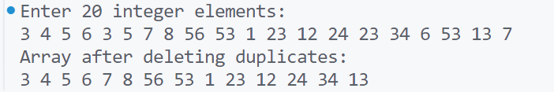

\setcounter{page}{41}

# PRACTICAL 20 -

**Objective** -  Write a program in c to delete duplicate elements from an array of 20 integers.

### CODE -

```
#include <stdio.h>

int main() {
    int arr[20];
    int n = 20;
    int i, j, k;
    // Input array elements
    printf("Enter %d integer elements:\n", n);
    for (i = 0; i < n; i++) {
        scanf("%d", &arr[i]);
    }
    // Delete duplicate elements
    for (i = 0; i < n; i++) {
        for (j = i + 1; j < n; j++) {
            if (arr[i] == arr[j]) {
                // Shift elements to remove the duplicate
                for (k = j; k < n - 1; k++) {
                    arr[k] = arr[k + 1];
                }
                n--; // Decrease the size of the array
                j--; // Adjust j to re-check the current position
            }
        }
    }
    // Print the array after deleting duplicates
    printf("Array after deleting duplicates:\n");
    for (i = 0; i < n; i++) {
        printf("%d ", arr[i]);
    }
    printf("\n");
    return 0;
}
```
\smallskip
### OUTPUT - 
