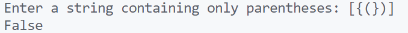
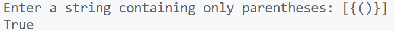

\setcounter{page}{42}

# PRACTICAL 21 -

**Objective** -  Given a string containing only parentheses '()[]{}', determine if the input string is valid (i.e., open brackets are closed in the correct order). 

### CODE -
```c
#include <stdio.h>
#include <stdbool.h>
#include <string.h>
#include <stdlib.h>

// Structure for a stack
struct Stack {
    int top;
    unsigned capacity;
    char* array;
};

// Function to create a stack
struct Stack* createStack(unsigned capacity) {
    struct Stack* stack = (struct Stack*) malloc(sizeof(struct Stack));
    stack->capacity = capacity;
    stack->top = -1;
    stack->array = (char*) malloc(stack->capacity * sizeof(char));
    return stack;
}

// Function to check if the stack is empty
bool isEmpty(struct Stack* stack) {
    return stack->top == -1;
}

// Function to push an element onto the stack
void push(struct Stack* stack, char item) {
    stack->array[++stack->top] = item;
}

// Function to pop an element from the stack
char pop(struct Stack* stack) {
    if (!isEmpty(stack)) {
        return stack->array[stack->top--];
    }
    return '\0'; // Return null character for empty stack
}

// Function to check if two characters are matching parentheses
bool isMatchingPair(char character1, char character2) {
    if (character1 == '(' && character2 == ')')
        return true;
    if (character1 == '{' && character2 == '}')
        return true;
    if (character1 == '[' && character2 == ']')
        return true;
    return false;
}

// Function to check if the given string of parentheses is valid
bool isValid(char* exp) {
    // Create a stack of sufficient capacity
    struct Stack* stack = createStack(strlen(exp));
    int i;

    // Iterate through the input string
    for (i = 0; exp[i]; i++) {
        // If the character is an opening parenthesis, push it onto the stack
        if (exp[i] == '(' || exp[i] == '{' || exp[i] == '[')
            push(stack, exp[i]);

        // If the character is a closing parenthesis
        if (exp[i] == ')' || exp[i] == '}' || exp[i] == ']') {
            // If the stack is empty, there is no matching opening parenthesis
            if (isEmpty(stack))
                return false;

            // Pop the top element from the stack
            char poppedChar = pop(stack);

            // Check if the popped character and the current character are a matching pair
            if (!isMatchingPair(poppedChar, exp[i]))
                return false;
        }
    }

    // If the stack is empty after processing the entire string, then all parentheses are balanced
    return isEmpty(stack);
}

int main() {
    char exp[100];

    printf("Enter a string containing only parentheses: ");
    scanf("%s", exp);

    if (isValid(exp))
        printf("True\n");
    else
        printf("False\n");

    return 0;
}
```

### OUTPUT -

   \
