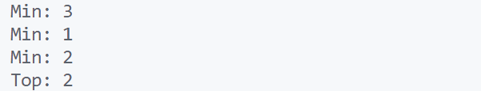

\setcounter{page}{45}

# PRACTICAL 23 -

**Objective** -  Objective - Design a stack that supports push, pop, top, and retrieving the minimum element in constant time.
Implement push(), pop(), top(), and getMin() methods.

### CODE -
```c
#include <stdio.h>
#include <stdlib.h>
#include <limits.h>
#include <stdbool.h>

// Structure for the stack
struct Stack {
    int top;
    unsigned capacity;
    int* array;
    int* minStack; // Auxiliary stack to track minimums
};

// Function to create a stack
struct Stack* createStack(unsigned capacity) {
    struct Stack* stack = (struct Stack*) malloc(sizeof(struct Stack));
    stack->capacity = capacity;
    stack->top = -1;
    stack->array = (int*) malloc(stack->capacity * sizeof(int));
    stack->minStack = (int*) malloc(stack->capacity * sizeof(int));
    return stack;
}

// Function to check if the stack is empty
bool isEmpty(struct Stack* stack) {
    return stack->top == -1;
}

// Function to check if the stack is full
bool isFull(struct Stack* stack) {
    return stack->top == stack->capacity - 1;
}

// Function to push an element onto the stack
void push(struct Stack* stack, int data) {
    if (isFull(stack))
        return;
    stack->array[++stack->top] = data;

    // Update minStack
    if (isEmpty(stack->minStack) || data <= stack->minStack[stack->minStack->top]) {
        stack->minStack[++stack->minStack->top] = data;
    }
}

// Function to pop an element from the stack
int pop(struct Stack* stack) {
    if (isEmpty(stack))
        return INT_MIN; // Indicate underflow
    int popped = stack->array[stack->top--];

    // Update minStack
    if (popped == stack->minStack[stack->minStack->top]) {
        stack->minStack--;
    }
    return popped;
}

// Function to get the top element of the stack
int top(struct Stack* stack) {
    if (isEmpty(stack))
        return INT_MIN; // Indicate empty stack
    return stack->array[stack->top];
}

// Function to get the minimum element in the stack
int getMin(struct Stack* stack) {
    if (isEmpty(stack->minStack))
        return INT_MIN; // Indicate empty stack
    return stack->minStack[stack->minStack->top];
}

int main() {
    struct Stack* stack = createStack(10);

    push(stack, 5);
    printf("Pushed: %d, Min: %d\n", 5, getMin(stack));
    push(stack, 2);
    printf("Pushed: %d, Min: %d\n", 2, getMin(stack));
    push(stack, 8);
    printf("Pushed: %d, Min: %d\n", 8, getMin(stack));
    push(stack, 1);
    printf("Pushed: %d, Min: %d\n", 1, getMin(stack));

    printf("Top: %d\n", top(stack));

    printf("Popped: %d, Min: %d\n", pop(stack), getMin(stack));
    printf("Popped: %d, Min: %d\n", pop(stack), getMin(stack));
    printf("Top: %d\n", top(stack));
    printf("Min: %d\n", getMin(stack));

    return 0;
}
```

### OUTPUT -

