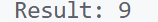

\setcounter{page}{48}

# PRACTICAL 23 -

**Objective** - Objective - Evaluate the value of an arithmetic expression in Reverse Polish Notation.
Input: ["2", "1", "+", "3", "*"] → Output: 9

### CODE -
```c
#include <stdio.h>
#include <stdlib.h>
#include <string.h>

// Function to check if the string is an operator
int is_operator(const char *token) {
    return (strcmp(token, "+") == 0 || strcmp(token, "-") == 0 || strcmp(token, "*") == 0 || strcmp(token, "/") == 0);
}

// Function to perform the operation
int perform_operation(int a, int b, const char *operator) {
    if (strcmp(operator, "+") == 0) return a + b;
    if (strcmp(operator, "-") == 0) return a - b;
    if (strcmp(operator, "*") == 0) return a * b;
    if (strcmp(operator, "/") == 0) return a / b;
    return 0;
}

// Function to evaluate Reverse Polish Notation
int evaluate_rpn(char **tokens, int size) {
    int stack[size]; // Stack to store intermediate results
    int top = -1;

    for (int i = 0; i < size; i++) {
        if (is_operator(tokens[i])) {
            // Pop the last two operands from the stack
            int b = stack[top--];
            int a = stack[top--];
            // Perform the operation and push the result back onto the stack
            int result = perform_operation(a, b, tokens[i]);
            stack[++top] = result;
        } else {
            // Push the operand onto the stack
            stack[++top] = atoi(tokens[i]);
        }
    }
    // The final result is at the top of the stack
    return stack[top];
}

int main() {
    // Example input: ["2", "1", "+", "3", "*"]
    char *tokens[] = {"2", "1", "+", "3", "*"};
    int size = sizeof(tokens) / sizeof(tokens[0]);

    // Evaluate the expression
    int result = evaluate_rpn(tokens, size);

    // Output the result
    printf("Result: %d\n", result);
    return 0;
}
```

### OUTPUT -

