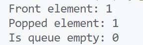

\setcounter{page}{50}

# PRACTICAL 24 -

**Objective** - Objective - Implement a first-in-first-out (FIFO) queue using only two stacks.
Support: push(x), pop(), peek(), and empty()

### CODE -
```c
#include <stdio.h>
#include <stdlib.h>

// Define the structure for a stack
typedef struct Stack {
    int *data;
    int top;
    int capacity;
} Stack;

// Function to create a stack
Stack* create_stack(int capacity) {
    Stack* stack = (Stack*)malloc(sizeof(Stack));
    stack->data = (int*)malloc(capacity * sizeof(int));
    stack->top = -1;
    stack->capacity = capacity;
    return stack;
}

// Function to check if the stack is empty
int is_empty(Stack* stack) {
    return stack->top == -1;
}

// Function to push an element onto the stack
void push(Stack* stack, int value) {
    stack->data[++stack->top] = value;
}

// Function to pop an element from the stack
int pop(Stack* stack) {
    return stack->data[stack->top--];
}

// Function to peek the top element of the stack
int peek(Stack* stack) {
    return stack->data[stack->top];
}

// Define the structure for the queue
typedef struct MyQueue {
    Stack* stack1;
    Stack* stack2;
} MyQueue;

// Function to initialize the queue
MyQueue* my_queue_create(int capacity) {
    MyQueue* queue = (MyQueue*)malloc(sizeof(MyQueue));
    queue->stack1 = create_stack(capacity);
    queue->stack2 = create_stack(capacity);
    return queue;
}

// Function to push an element into the queue
void my_queue_push(MyQueue* queue, int x) {
    push(queue->stack1, x);
}

// Function to pop the front element from the queue
int my_queue_pop(MyQueue* queue) {
    if (is_empty(queue->stack2)) {
        while (!is_empty(queue->stack1)) {
            push(queue->stack2, pop(queue->stack1));
        }
    }
    return pop(queue->stack2);
}

// Function to get the front element of the queue
int my_queue_peek(MyQueue* queue) {
    if (is_empty(queue->stack2)) {
        while (!is_empty(queue->stack1)) {
            push(queue->stack2, pop(queue->stack1));
        }
    }
    return peek(queue->stack2);
}

// Function to check if the queue is empty
int my_queue_empty(MyQueue* queue) {
    return is_empty(queue->stack1) && is_empty(queue->stack2);
}

// Main function to demonstrate the usage of the queue
int main() {
    MyQueue* queue = my_queue_create(100);

    my_queue_push(queue, 1);
    my_queue_push(queue, 2);
    my_queue_push(queue, 3);

    printf("Front element: %d\n", my_queue_peek(queue)); // Output: 1
    printf("Popped element: %d\n", my_queue_pop(queue)); // Output: 1
    printf("Is queue empty: %d\n", my_queue_empty(queue)); // Output: 0

    return 0;
}
```

### OUTPUT -

