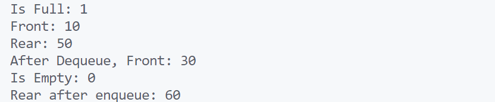

\setcounter{page}{53}

# PRACTICAL 25 -

**Objective** - Objective - Implement a circular queue with a fixed size. Support enQueue(), deQueue(), Front(), Rear(), isEmpty(), and isFull() operations.

### CODE -
```c
#include <stdio.h>
#include <stdlib.h>
#include <stdbool.h>

// Define the structure for the circular queue
typedef struct CircularQueue {
    int *data;
    int front;
    int rear;
    int size;
    int capacity;
} CircularQueue;

// Function to create a circular queue
CircularQueue* circular_queue_create(int capacity) {
    CircularQueue* queue = (CircularQueue*)malloc(sizeof(CircularQueue));
    queue->data = (int*)malloc(capacity * sizeof(int));
    queue->front = -1;
    queue->rear = -1;
    queue->size = 0;
    queue->capacity = capacity;
    return queue;
}

// Function to check if the queue is empty
bool is_empty(CircularQueue* queue) {
    return queue->size == 0;
}

// Function to check if the queue is full
bool is_full(CircularQueue* queue) {
    return queue->size == queue->capacity;
}

// Function to enqueue an element into the queue
bool en_queue(CircularQueue* queue, int value) {
    if (is_full(queue)) return false;
    if (queue->front == -1) queue->front = 0; // First element
    queue->rear = (queue->rear + 1) % queue->capacity;
    queue->data[queue->rear] = value;
    queue->size++;
    return true;
}

// Function to dequeue an element from the queue
bool de_queue(CircularQueue* queue) {
    if (is_empty(queue)) return false;
    if (queue->front == queue->rear) {
        queue->front = -1; // Reset to initial state
        queue->rear = -1;
    } else {
        queue->front = (queue->front + 1) % queue->capacity;
    }
    queue->size--;
    return true;
}

// Function to get the front element of the queue
int front(CircularQueue* queue) {
    if (is_empty(queue)) return -1;
    return queue->data[queue->front];
}

// Function to get the rear element of the queue
int rear(CircularQueue* queue) {
    if (is_empty(queue)) return -1;
    return queue->data[queue->rear];
}

// Main function to demonstrate the usage of the circular queue
int main() {
    CircularQueue* queue = circular_queue_create(5);

    en_queue(queue, 10);
    en_queue(queue, 20);
    en_queue(queue, 30);
    en_queue(queue, 40);
    en_queue(queue, 50);

    printf("Is Full: %d\n", is_full(queue)); // Output: 1 (true)
    printf("Front: %d\n", front(queue));     // Output: 10
    printf("Rear: %d\n", rear(queue));       // Output: 50

    de_queue(queue);
    de_queue(queue);

    printf("After Dequeue, Front: %d\n", front(queue)); // Output: 30
    printf("Is Empty: %d\n", is_empty(queue));         // Output: 0 (false)

    en_queue(queue, 60);
    printf("Rear after enqueue: %d\n", rear(queue));   // Output: 60

    return 0;
}
```

### OUTPUT -

