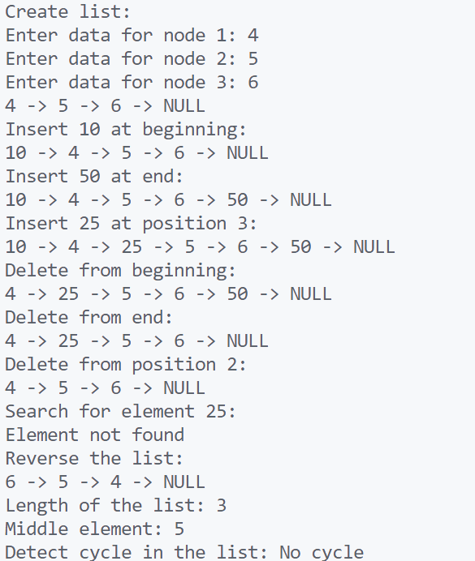

\setcounter{page}{56}

# PRACTICAL 26 -

**Objective** - Objective - Basic operations on Single Linked list

1. **Create a Singly Linked List**  
    Write a program to create a singly linked list with `n` nodes and display it.

2. **Insert at Beginning**  
    Implement a function to insert a node at the beginning of a linked list.

3. **Insert at End**  
    Write a program to insert a node at the end of a singly linked list.

4. **Insert at a Given Position**  
    Implement insertion of a node at a specific position in a linked list.

5. **Delete from Beginning**  
    Write a function to delete the first node of a singly linked list.

6. **Delete from End**  
    Delete the last node from a linked list.

7. **Delete from a Given Position**  
    Implement deletion of a node at a specified index in a singly linked list.

8. **Search an Element**  
    Write a program to search for an element in a linked list and return its position.

9. **Reverse a Linked List**  
    Implement a function to reverse a singly linked list.

10. **Find Length of Linked List**  
     Write a function to count and return the total number of nodes in a linked list.

11. **Find the Middle Node**  
     Find and return the middle element of a linked list using two-pointer technique.

12. **Detect a Loop (Cycle) in Linked List**  
    Detect whether a cycle exists in a linked list.  
    

### CODE -
```c
#include <stdio.h>
#include <stdlib.h>

// Definition of a node in the linked list
typedef struct Node {
    int data;
    struct Node* next;
} Node;

// Function to create a new node
Node* create_node(int data) {
    Node* new_node = (Node*)malloc(sizeof(Node));
    new_node->data = data;
    new_node->next = NULL;
    return new_node;
}

// Create a singly linked list with n nodes and display it
Node* create_list(int n) {
    Node* head = NULL;
    Node* temp = NULL;
    for (int i = 0; i < n; i++) {
        int data;
        printf("Enter data for node %d: ", i + 1);
        scanf("%d", &data);
        Node* new_node = create_node(data);
        if (!head) {
            head = new_node;
        } else {
            temp->next = new_node;
        }
        temp = new_node;
    }
    return head;
}

// Display the linked list
void display_list(Node* head) {
    Node* temp = head;
    while (temp != NULL) {
        printf("%d -> ", temp->data);
        temp = temp->next;
    }
    printf("NULL\n");
}

// Insert at the beginning
Node* insert_at_beginning(Node* head, int data) {
    Node* new_node = create_node(data);
    new_node->next = head;
    return new_node;
}

// Insert at the end
Node* insert_at_end(Node* head, int data) {
    Node* new_node = create_node(data);
    if (!head) return new_node;
    Node* temp = head;
    while (temp->next != NULL) {
        temp = temp->next;
    }
    temp->next = new_node;
    return head;
}

// Insert at a given position
Node* insert_at_position(Node* head, int data, int position) {
    if (position == 1) return insert_at_beginning(head, data);
    Node* new_node = create_node(data);
    Node* temp = head;
    for (int i = 1; i < position - 1 && temp != NULL; i++) {
        temp = temp->next;
    }
    if (!temp) return head;
    new_node->next = temp->next;
    temp->next = new_node;
    return head;
}

// Delete from beginning
Node* delete_from_beginning(Node* head) {
    if (!head) return NULL;
    Node* temp = head;
    head = head->next;
    free(temp);
    return head;
}

// Delete from end
Node* delete_from_end(Node* head) {
    if (!head || !head->next) {
        free(head);
        return NULL;
    }
    Node* temp = head;
    while (temp->next->next != NULL) {
        temp = temp->next;
    }
    free(temp->next);
    temp->next = NULL;
    return head;
}

// Delete from a given position
Node* delete_from_position(Node* head, int position) {
    if (position == 1) return delete_from_beginning(head);
    Node* temp = head;
    for (int i = 1; i < position - 1 && temp != NULL; i++) {
        temp = temp->next;
    }
    if (!temp || !temp->next) return head;
    Node* node_to_delete = temp->next;
    temp->next = node_to_delete->next;
    free(node_to_delete);
    return head;
}

// Search an element
int search_element(Node* head, int key) {
    Node* temp = head;
    int position = 1;
    while (temp != NULL) {
        if (temp->data == key) return position;
        temp = temp->next;
        position++;
    }
    return -1;
}

// Reverse a linked list
Node* reverse_list(Node* head) {
    Node* prev = NULL;
    Node* current = head;
    Node* next = NULL;
    while (current != NULL) {
        next = current->next;
        current->next = prev;
        prev = current;
        current = next;
    }
    return prev;
}

// Find length of linked list
int find_length(Node* head) {
    int count = 0;
    Node* temp = head;
    while (temp != NULL) {
        count++;
        temp = temp->next;
    }
    return count;
}

// Find the middle node
Node* find_middle_node(Node* head) {
    Node* slow = head;
    Node* fast = head;
    while (fast != NULL && fast->next != NULL) {
        slow = slow->next;
        fast = fast->next->next;
    }
    return slow;
}

// Detect a loop in linked list
int detect_cycle(Node* head) {
    Node* slow = head;
    Node* fast = head;
    while (fast != NULL && fast->next != NULL) {
        slow = slow->next;
        fast = fast->next->next;
        if (slow == fast) return 1;
    }
    return 0;
}

// Main function to demonstrate the operations
int main() {
    Node* head = NULL;

    // Create a list with 3 nodes
    printf("Create list:\n");
    head = create_list(3);
    display_list(head);

    // Insert at beginning
    printf("Insert 10 at beginning:\n");
    head = insert_at_beginning(head, 10);
    display_list(head);

    // Insert at end
    printf("Insert 50 at end:\n");
    head = insert_at_end(head, 50);
    display_list(head);

    // Insert at position
    printf("Insert 25 at position 3:\n");
    head = insert_at_position(head, 25, 3);
    display_list(head);

    // Delete from beginning
    printf("Delete from beginning:\n");
    head = delete_from_beginning(head);
    display_list(head);

    // Delete from end
    printf("Delete from end:\n");
    head = delete_from_end(head);
    display_list(head);

    // Delete from position
    printf("Delete from position 2:\n");
    head = delete_from_position(head, 2);
    display_list(head);

    // Search for an element
    printf("Search for element 25:\n");
    int position = search_element(head, 25);
    if (position != -1) {
        printf("Element found at position: %d\n", position);
    } else {
        printf("Element not found\n");
    }

    // Reverse the list
    printf("Reverse the list:\n");
    head = reverse_list(head);
    display_list(head);

    // Find length of the list
    printf("Length of the list: %d\n", find_length(head));

    // Find the middle node
    Node* middle = find_middle_node(head);
    if (middle) {
        printf("Middle element: %d\n", middle->data);
    }

    // Detect cycle in the list
    printf("Detect cycle in the list: %s\n", detect_cycle(head) ? "Cycle found" : "No cycle");

    return 0;
}
```

### OUTPUT -

