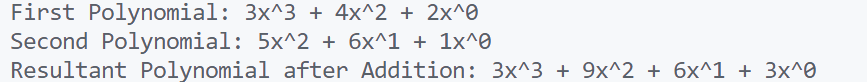

\setcounter{page}{63}

# PRACTICAL 27 -

**Objective** - Objective -  Write a program to represent two polynomials using singly linked lists and perform addition of these two polynomials.

### CODE -
```c
#include <stdio.h>
#include <stdlib.h>

// Definition of a node in the linked list
typedef struct PolynomialNode {
    int coefficient;
    int exponent;
    struct PolynomialNode* next;
} PolynomialNode;

// Function to create a new node
PolynomialNode* create_node(int coefficient, int exponent) {
    PolynomialNode* new_node = (PolynomialNode*)malloc(sizeof(PolynomialNode));
    new_node->coefficient = coefficient;
    new_node->exponent = exponent;
    new_node->next = NULL;
    return new_node;
}

// Function to insert a node into the polynomial in sorted order (by exponent)
PolynomialNode* insert_node(PolynomialNode* head, int coefficient, int exponent) {
    PolynomialNode* new_node = create_node(coefficient, exponent);
    if (!head || head->exponent < exponent) {
        new_node->next = head;
        return new_node;
    }
    PolynomialNode* temp = head;
    while (temp->next && temp->next->exponent >= exponent) {
        temp = temp->next;
    }
    if (temp->exponent == exponent) {
        temp->coefficient += coefficient; // Combine terms with same exponent
        free(new_node);
    } else {
        new_node->next = temp->next;
        temp->next = new_node;
    }
    return head;
}

// Function to display a polynomial
void display_polynomial(PolynomialNode* head) {
    PolynomialNode* temp = head;
    while (temp) {
        printf("%dx^%d", temp->coefficient, temp->exponent);
        if (temp->next) printf(" + ");
        temp = temp->next;
    }
    printf("\n");
}

// Function to add two polynomials
PolynomialNode* add_polynomials(PolynomialNode* poly1, PolynomialNode* poly2) {
    PolynomialNode* result = NULL;
    while (poly1 && poly2) {
        if (poly1->exponent > poly2->exponent) {
            result = insert_node(result, poly1->coefficient, poly1->exponent);
            poly1 = poly1->next;
        } else if (poly1->exponent < poly2->exponent) {
            result = insert_node(result, poly2->coefficient, poly2->exponent);
            poly2 = poly2->next;
        } else {
            result = insert_node(result, poly1->coefficient + poly2->coefficient, poly1->exponent);
            poly1 = poly1->next;
            poly2 = poly2->next;
        }
    }
    while (poly1) {
        result = insert_node(result, poly1->coefficient, poly1->exponent);
        poly1 = poly1->next;
    }
    while (poly2) {
        result = insert_node(result, poly2->coefficient, poly2->exponent);
        poly2 = poly2->next;
    }
    return result;
}

// Main function to demonstrate polynomial addition
int main() {
    PolynomialNode* poly1 = NULL;
    PolynomialNode* poly2 = NULL;

    // Create first polynomial: 3x^3 + 4x^2 + 2
    poly1 = insert_node(poly1, 3, 3);
    poly1 = insert_node(poly1, 4, 2);
    poly1 = insert_node(poly1, 2, 0);

    // Create second polynomial: 5x^2 + 6x + 1
    poly2 = insert_node(poly2, 5, 2);
    poly2 = insert_node(poly2, 6, 1);
    poly2 = insert_node(poly2, 1, 0);

    printf("First Polynomial: ");
    display_polynomial(poly1);

    printf("Second Polynomial: ");
    display_polynomial(poly2);

    // Add the two polynomials
    PolynomialNode* result = add_polynomials(poly1, poly2);

    printf("Resultant Polynomial after Addition: ");
    display_polynomial(result);

    return 0;
}
```

### OUTPUT -

