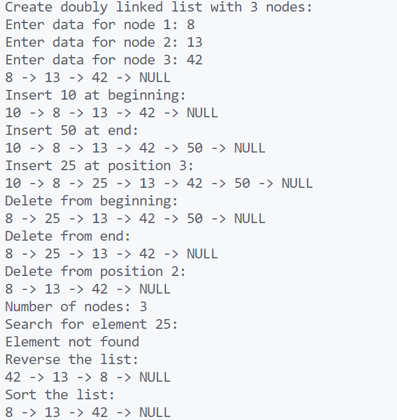

\setcounter{page}{66}

# PRACTICAL 28 -

Objective - Basic operations on Double Linked list

1. **Create a Doubly Linked List**  
    Write a program to create a doubly linked list with `n` nodes and display it in forward order.

2. **Insert at Beginning**  
    Implement a function to insert a node at the beginning of a doubly linked list.

3. **Insert at End**  
    Write a program to insert a node at the end of a doubly linked list.

4. **Insert at a Specific Position**  
    Add a node at a given position in the doubly linked list.

5. **Delete from Beginning**  
    Remove the first node from the doubly linked list.

6. **Delete from End**  
    Remove the last node from the doubly linked list.

7. **Delete from a Given Position**  
    Delete a node from a specific position in a doubly linked list.

8. **Traverse in Forward Direction**  
    Display all elements from head to tail.

9. **Traverse in Backward Direction**  
    Display all elements from tail to head using `prev` pointers.

10. **Count Nodes in a Doubly Linked List**  
     Return the total number of nodes in a doubly linked list.

11. **Search an Element in Doubly Linked List**  
     Search for a value in a doubly linked list and return its position.

12. **Reverse a Doubly Linked List**  
     Reverse a doubly linked list using pointer manipulation.

13. **Insert Before a Given Node**  
     Insert a new node before a specified node in a doubly linked list.

14. **Insert After a Given Node**  
     Insert a new node after a specified node in a doubly linked list.

15. **Delete a Node by Value**  
     Find a node by its value and delete it from the list.

16. **Sort a Doubly Linked List using Bubble Sort**  
    Implement bubble sort to sort the data in the doubly linked list. 

### CODE -
```c
#include <stdio.h>
#include <stdlib.h>

// Definition of a node in the doubly linked list
typedef struct Node {
    int data;
    struct Node* prev;
    struct Node* next;
} Node;

// Function to create a new node
Node* create_node(int data) {
    Node* new_node = (Node*)malloc(sizeof(Node));
    new_node->data = data;
    new_node->prev = NULL;
    new_node->next = NULL;
    return new_node;
}

// Create a doubly linked list with n nodes and display it
Node* create_list(int n) {
    Node* head = NULL;
    Node* tail = NULL;
    for (int i = 0; i < n; i++) {
        int data;
        printf("Enter data for node %d: ", i + 1);
        scanf("%d", &data);
        Node* new_node = create_node(data);
        if (!head) {
            head = new_node;
        } else {
            tail->next = new_node;
            new_node->prev = tail;
        }
        tail = new_node;
    }
    return head;
}

// Display list in forward direction
void display_forward(Node* head) {
    Node* temp = head;
    while (temp) {
        printf("%d -> ", temp->data);
        temp = temp->next;
    }
    printf("NULL\n");
}

// Display list in backward direction
void display_backward(Node* tail) {
    while (tail) {
        printf("%d -> ", tail->data);
        tail = tail->prev;
    }
    printf("NULL\n");
}

// Insert at the beginning
Node* insert_at_beginning(Node* head, int data) {
    Node* new_node = create_node(data);
    if (head) {
        head->prev = new_node;
        new_node->next = head;
    }
    return new_node;
}

// Insert at the end
Node* insert_at_end(Node* head, int data) {
    Node* new_node = create_node(data);
    if (!head) return new_node;
    Node* temp = head;
    while (temp->next) {
        temp = temp->next;
    }
    temp->next = new_node;
    new_node->prev = temp;
    return head;
}

// Insert at a specific position
Node* insert_at_position(Node* head, int data, int position) {
    if (position == 1) return insert_at_beginning(head, data);
    Node* new_node = create_node(data);
    Node* temp = head;
    for (int i = 1; i < position - 1 && temp; i++) {
        temp = temp->next;
    }
    if (!temp) return head;
    new_node->next = temp->next;
    if (temp->next) temp->next->prev = new_node;
    temp->next = new_node;
    new_node->prev = temp;
    return head;
}

// Delete from beginning
Node* delete_from_beginning(Node* head) {
    if (!head) return NULL;
    Node* temp = head;
    head = head->next;
    if (head) head->prev = NULL;
    free(temp);
    return head;
}

// Delete from end
Node* delete_from_end(Node* head) {
    if (!head) return NULL;
    if (!head->next) {
        free(head);
        return NULL;
    }
    Node* temp = head;
    while (temp->next) {
        temp = temp->next;
    }
    temp->prev->next = NULL;
    free(temp);
    return head;
}

// Delete from a specific position
Node* delete_from_position(Node* head, int position) {
    if (position == 1) return delete_from_beginning(head);
    Node* temp = head;
    for (int i = 1; i < position && temp; i++) {
        temp = temp->next;
    }
    if (!temp) return head;
    if (temp->next) temp->next->prev = temp->prev;
    if (temp->prev) temp->prev->next = temp->next;
    free(temp);
    return head;
}

// Count nodes in the list
int count_nodes(Node* head) {
    int count = 0;
    while (head) {
        count++;
        head = head->next;
    }
    return count;
}

// Search an element
int search_element(Node* head, int key) {
    int position = 1;
    while (head) {
        if (head->data == key) return position;
        head = head->next;
        position++;
    }
    return -1;
}

// Reverse the list
Node* reverse_list(Node* head) {
    Node* temp = NULL;
    Node* current = head;
    while (current) {
        temp = current->prev;
        current->prev = current->next;
        current->next = temp;
        current = current->prev;
    }
    return temp ? temp->prev : head;
}

// Insert before a given node
Node* insert_before(Node* head, Node* target, int data) {
    if (!target) return head;
    if (target == head) return insert_at_beginning(head, data);
    Node* new_node = create_node(data);
    new_node->prev = target->prev;
    new_node->next = target;
    if (target->prev) target->prev->next = new_node;
    target->prev = new_node;
    return head;
}

// Insert after a given node
Node* insert_after(Node* head, Node* target, int data) {
    if (!target) return head;
    Node* new_node = create_node(data);
    new_node->next = target->next;
    new_node->prev = target;
    if (target->next) target->next->prev = new_node;
    target->next = new_node;
    return head;
}

// Delete a node by value
Node* delete_by_value(Node* head, int value) {
    Node* temp = head;
    while (temp && temp->data != value) {
        temp = temp->next;
    }
    if (!temp) return head;
    if (temp == head) return delete_from_beginning(head);
    if (temp->next) temp->next->prev = temp->prev;
    if (temp->prev) temp->prev->next = temp->next;
    free(temp);
    return head;
}

// Sort the list using bubble sort
Node* bubble_sort(Node* head) {
    if (!head) return head;
    int swapped;
    Node* temp;
    Node* last = NULL;
    do {
        swapped = 0;
        temp = head;
        while (temp->next != last) {
            if (temp->data > temp->next->data) {
                int temp_data = temp->data;
                temp->data = temp->next->data;
                temp->next->data = temp_data;
                swapped = 1;
            }
            temp = temp->next;
        }
        last = temp;
    } while (swapped);
    return head;
}

// Main function to demonstrate all operations
int main() {
    Node* head = NULL;

    // Create and display list
    printf("Create doubly linked list with 3 nodes:\n");
    head = create_list(3);
    display_forward(head);

    // Insert at beginning
    printf("Insert 10 at beginning:\n");
    head = insert_at_beginning(head, 10);
    display_forward(head);

    // Insert at end
    printf("Insert 50 at end:\n");
    head = insert_at_end(head, 50);
    display_forward(head);

    // Insert at position
    printf("Insert 25 at position 3:\n");
    head = insert_at_position(head, 25, 3);
    display_forward(head);

    // Delete from beginning
    printf("Delete from beginning:\n");
    head = delete_from_beginning(head);
    display_forward(head);

    // Delete from end
    printf("Delete from end:\n");
    head = delete_from_end(head);
    display_forward(head);

    // Delete from position
    printf("Delete from position 2:\n");
    head = delete_from_position(head, 2);
    display_forward(head);

    // Count nodes
    printf("Number of nodes: %d\n", count_nodes(head));

    // Search for an element
    printf("Search for element 25:\n");
    int position = search_element(head, 25);
    if (position != -1) {
        printf("Element found at position: %d\n", position);
    } else {
        printf("Element not found\n");
    }

    // Reverse the list
    printf("Reverse the list:\n");
    head = reverse_list(head);
    display_forward(head);

    // Bubble sort the list
    printf("Sort the list:\n");
    head = bubble_sort(head);
    display_forward(head);

    return 0;
}
```

### OUTPUT -

