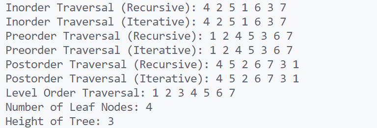

\setcounter{page}{74}

# PRACTICAL 29 -

**Objective** - 
Objective - Operations on Binary Tree

1. **Create a Binary Tree**  
    Write a program to create a binary tree and perform level-wise insertion.

2. **Inorder Traversal (Recursive and Iterative)**  
    Traverse the binary tree in **inorder** fashion and display the result.

3. **Preorder Traversal (Recursive and Iterative)**  
    Traverse the binary tree in **preorder** and print the nodes.

4. **Postorder Traversal (Recursive and Iterative)**  
    Perform **postorder** traversal of the binary tree.

5. **Level Order Traversal (Breadth-First Search)**  
    Print the tree level by level using a queue.

6. **Count Leaf Nodes**  
    Write a function to count the number of leaf nodes in a binary tree.

7. **Find Height of Tree**  
    Calculate the maximum height (or depth) of a binary tree.

8. **Check if Binary Tree is Balanced**  
    Write a function to determine whether a binary tree is height-balanced.
### CODE -
```c
#include <stdio.h>
#include <stdlib.h>
#include <stdbool.h>

// Definition of a node in the binary tree
typedef struct TreeNode {
    int data;
    struct TreeNode* left;
    struct TreeNode* right;
} TreeNode;

// Create a new node
TreeNode* create_node(int data) {
    TreeNode* new_node = (TreeNode*)malloc(sizeof(TreeNode));
    new_node->data = data;
    new_node->left = NULL;
    new_node->right = NULL;
    return new_node;
}

// Level-wise insertion in binary tree
TreeNode* insert_level_order(TreeNode* root, int data) {
    TreeNode* new_node = create_node(data);
    if (!root) return new_node;

    TreeNode* temp;
    TreeNode* queue[100];
    int front = 0, rear = 0;
    queue[rear++] = root;

    while (front < rear) {
        temp = queue[front++];
        if (!temp->left) {
            temp->left = new_node;
            return root;
        } else {
            queue[rear++] = temp->left;
        }
        if (!temp->right) {
            temp->right = new_node;
            return root;
        } else {
            queue[rear++] = temp->right;
        }
    }
    return root;
}

// Inorder Traversal (Recursive)
void inorder_recursive(TreeNode* root) {
    if (root) {
        inorder_recursive(root->left);
        printf("%d ", root->data);
        inorder_recursive(root->right);
    }
}

// Inorder Traversal (Iterative)
void inorder_iterative(TreeNode* root) {
    TreeNode* stack[100];
    int top = -1;
    TreeNode* current = root;

    while (current || top != -1) {
        while (current) {
            stack[++top] = current;
            current = current->left;
        }
        current = stack[top--];
        printf("%d ", current->data);
        current = current->right;
    }
}

// Preorder Traversal (Recursive)
void preorder_recursive(TreeNode* root) {
    if (root) {
        printf("%d ", root->data);
        preorder_recursive(root->left);
        preorder_recursive(root->right);
    }
}

// Preorder Traversal (Iterative)
void preorder_iterative(TreeNode* root) {
    if (!root) return;

    TreeNode* stack[100];
    int top = -1;
    stack[++top] = root;

    while (top != -1) {
        TreeNode* current = stack[top--];
        printf("%d ", current->data);

        if (current->right) stack[++top] = current->right;
        if (current->left) stack[++top] = current->left;
    }
}

// Postorder Traversal (Recursive)
void postorder_recursive(TreeNode* root) {
    if (root) {
        postorder_recursive(root->left);
        postorder_recursive(root->right);
        printf("%d ", root->data);
    }
}

// Postorder Traversal (Iterative)
void postorder_iterative(TreeNode* root) {
    if (!root) return;

    TreeNode* stack1[100], *stack2[100];
    int top1 = -1, top2 = -1;
    stack1[++top1] = root;

    while (top1 != -1) {
        TreeNode* current = stack1[top1--];
        stack2[++top2] = current;

        if (current->left) stack1[++top1] = current->left;
        if (current->right) stack1[++top1] = current->right;
    }

    while (top2 != -1) {
        printf("%d ", stack2[top2--]->data);
    }
}

// Level Order Traversal (Breadth-First Search)
void level_order_traversal(TreeNode* root) {
    if (!root) return;

    TreeNode* queue[100];
    int front = 0, rear = 0;
    queue[rear++] = root;

    while (front < rear) {
        TreeNode* current = queue[front++];
        printf("%d ", current->data);

        if (current->left) queue[rear++] = current->left;
        if (current->right) queue[rear++] = current->right;
    }
}

// Count Leaf Nodes
int count_leaf_nodes(TreeNode* root) {
    if (!root) return 0;
    if (!root->left && !root->right) return 1;

    return count_leaf_nodes(root->left) + count_leaf_nodes(root->right);
}

// Find Height of Tree
int find_height(TreeNode* root) {
    if (!root) return 0;

    int left_height = find_height(root->left);
    int right_height = find_height(root->right);

    return 1 + (left_height > right_height ? left_height : right_height);
}

// Check if Binary Tree is Balanced
bool is_balanced(TreeNode* root) {
    if (!root) return true;

    int left_height = find_height(root->left);
    int right_height = find_height(root->right);

    if (abs(left_height - right_height) > 1) return false;

    return is_balanced(root->left) && is_balanced(root->right);
}

// Main function to demonstrate all operations
int main() {
    TreeNode* root = NULL;

    // Create binary tree
    root = insert_level_order(root, 1);
    root = insert_level_order(root, 2);
    root = insert_level_order(root, 3);
    root = insert_level_order(root, 4);
    root = insert_level_order(root, 5);
    root = insert_level_order(root, 6);
    root = insert_level_order(root, 7);

    // Traversals
    printf("Inorder Traversal (Recursive): ");
    inorder_recursive(root);
    printf("\nInorder Traversal (Iterative): ");
    inorder_iterative(root);

    printf("\nPreorder Traversal (Recursive): ");
    preorder_recursive(root);
    printf("\nPreorder Traversal (Iterative): ");
    preorder_iterative(root);

    printf("\nPostorder Traversal (Recursive): ");
    postorder_recursive(root);
    printf("\nPostorder Traversal (Iterative): ");
    postorder_iterative(root);

    printf("\nLevel Order Traversal: ");
    level_order_traversal(root);

    // Count leaf nodes
    printf("\nNumber of Leaf Nodes: %d\n", count_leaf_nodes(root));

    // Find height of tree
    printf("Height of Tree: %d\n", find_height(root));

    // Check if tree is balanced
    printf("Is Tree Balanced: %s\n", is_balanced(root) ? "Yes" : "No");

    return 0;
}
```

### OUTPUT -

