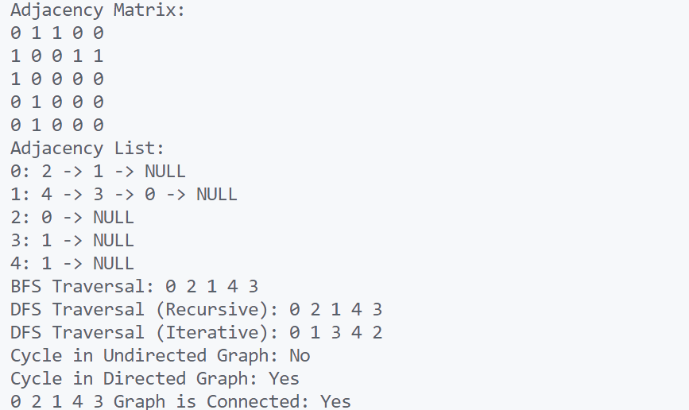

\setcounter{page}{80}

# PRACTICAL 29 -

Objective - Operations on Graph

1. **Graph Representation (Adjacency Matrix & List)**  
    Write a program to represent a graph using both adjacency list and adjacency matrix.

2. **Breadth-First Search (BFS)**  
    Perform BFS traversal of a graph from a given starting node.

3. **Depth-First Search (DFS)**  
    Implement DFS traversal of a graph using recursion and stack.

4. **Detect Cycle in an Undirected Graph**  
    Use DFS or BFS to detect if a cycle exists in an undirected graph.

5. **Detect Cycle in a Directed Graph**  
    Detect cycle using DFS and back edge technique in a directed graph.

6. **Check if a Graph is Connected**  
    Given a graph, check if all vertices are reachable from a starting point.


### CODE -
```c
#include <stdio.h>
#include <stdlib.h>
#include <stdbool.h>

// Define the structure for adjacency list node
typedef struct AdjListNode {
    int vertex;
    struct AdjListNode* next;
} AdjListNode;

// Define the structure for adjacency list
typedef struct AdjList {
    AdjListNode* head;
} AdjList;

// Define the structure for graph
typedef struct Graph {
    int numVertices;
    int** adjMatrix;
    AdjList* adjLists;
} Graph;

// Create a new graph
Graph* create_graph(int numVertices) {
    Graph* graph = (Graph*)malloc(sizeof(Graph));
    graph->numVertices = numVertices;

    // Initialize adjacency matrix
    graph->adjMatrix = (int**)malloc(numVertices * sizeof(int*));
    for (int i = 0; i < numVertices; i++) {
        graph->adjMatrix[i] = (int*)calloc(numVertices, sizeof(int));
    }

    // Initialize adjacency lists
    graph->adjLists = (AdjList*)malloc(numVertices * sizeof(AdjList));
    for (int i = 0; i < numVertices; i++) {
        graph->adjLists[i].head = NULL;
    }

    return graph;
}

// Create a new adjacency list node
AdjListNode* create_adj_list_node(int vertex) {
    AdjListNode* newNode = (AdjListNode*)malloc(sizeof(AdjListNode));
    newNode->vertex = vertex;
    newNode->next = NULL;
    return newNode;
}

// Add an edge to the graph (both adjacency matrix and list)
void add_edge(Graph* graph, int src, int dest) {
    // Add to adjacency matrix
    graph->adjMatrix[src][dest] = 1;
    graph->adjMatrix[dest][src] = 1; // For undirected graph

    // Add to adjacency list
    AdjListNode* newNode = create_adj_list_node(dest);
    newNode->next = graph->adjLists[src].head;
    graph->adjLists[src].head = newNode;

    newNode = create_adj_list_node(src);
    newNode->next = graph->adjLists[dest].head;
    graph->adjLists[dest].head = newNode;
}

// Display adjacency matrix
void display_adj_matrix(Graph* graph) {
    printf("Adjacency Matrix:\n");
    for (int i = 0; i < graph->numVertices; i++) {
        for (int j = 0; j < graph->numVertices; j++) {
            printf("%d ", graph->adjMatrix[i][j]);
        }
        printf("\n");
    }
}

// Display adjacency list
void display_adj_list(Graph* graph) {
    printf("Adjacency List:\n");
    for (int i = 0; i < graph->numVertices; i++) {
        printf("%d: ", i);
        AdjListNode* temp = graph->adjLists[i].head;
        while (temp) {
            printf("%d -> ", temp->vertex);
            temp = temp->next;
        }
        printf("NULL\n");
    }
}

// Breadth-First Search (BFS)
void bfs(Graph* graph, int startVertex) {
    bool visited[graph->numVertices];
    for (int i = 0; i < graph->numVertices; i++) visited[i] = false;

    int queue[graph->numVertices];
    int front = 0, rear = 0;

    visited[startVertex] = true;
    queue[rear++] = startVertex;

    printf("BFS Traversal: ");
    while (front < rear) {
        int currentVertex = queue[front++];
        printf("%d ", currentVertex);

        AdjListNode* temp = graph->adjLists[currentVertex].head;
        while (temp) {
            int adjVertex = temp->vertex;
            if (!visited[adjVertex]) {
                visited[adjVertex] = true;
                queue[rear++] = adjVertex;
            }
            temp = temp->next;
        }
    }
    printf("\n");
}

// Depth-First Search (DFS) Recursive
void dfs_recursive_util(Graph* graph, int vertex, bool visited[]) {
    visited[vertex] = true;
    printf("%d ", vertex);

    AdjListNode* temp = graph->adjLists[vertex].head;
    while (temp) {
        if (!visited[temp->vertex]) {
            dfs_recursive_util(graph, temp->vertex, visited);
        }
        temp = temp->next;
    }
}

void dfs_recursive(Graph* graph, int startVertex) {
    bool visited[graph->numVertices];
    for (int i = 0; i < graph->numVertices; i++) visited[i] = false;

    printf("DFS Traversal (Recursive): ");
    dfs_recursive_util(graph, startVertex, visited);
    printf("\n");
}

// Depth-First Search (DFS) Iterative
void dfs_iterative(Graph* graph, int startVertex) {
    bool visited[graph->numVertices];
    for (int i = 0; i < graph->numVertices; i++) visited[i] = false;

    int stack[graph->numVertices];
    int top = -1;

    stack[++top] = startVertex;

    printf("DFS Traversal (Iterative): ");
    while (top != -1) {
        int currentVertex = stack[top--];

        if (!visited[currentVertex]) {
            visited[currentVertex] = true;
            printf("%d ", currentVertex);
        }

        AdjListNode* temp = graph->adjLists[currentVertex].head;
        while (temp) {
            if (!visited[temp->vertex]) {
                stack[++top] = temp->vertex;
            }
            temp = temp->next;
        }
    }
    printf("\n");
}

// Detect cycle in an undirected graph using DFS
bool detect_cycle_undirected_dfs(Graph* graph, int vertex, bool visited[], int parent) {
    visited[vertex] = true;

    AdjListNode* temp = graph->adjLists[vertex].head;
    while (temp) {
        if (!visited[temp->vertex]) {
            if (detect_cycle_undirected_dfs(graph, temp->vertex, visited, vertex)) {
                return true;
            }
        } else if (temp->vertex != parent) {
            return true;
        }
        temp = temp->next;
    }
    return false;
}

bool detect_cycle_undirected(Graph* graph) {
    bool visited[graph->numVertices];
    for (int i = 0; i < graph->numVertices; i++) visited[i] = false;

    for (int i = 0; i < graph->numVertices; i++) {
        if (!visited[i]) {
            if (detect_cycle_undirected_dfs(graph, i, visited, -1)) {
                return true;
            }
        }
    }
    return false;
}

// Detect cycle in a directed graph using DFS
bool detect_cycle_directed_dfs(Graph* graph, int vertex, bool visited[], bool recStack[]) {
    if (!visited[vertex]) {
        visited[vertex] = true;
        recStack[vertex] = true;

        AdjListNode* temp = graph->adjLists[vertex].head;
        while (temp) {
            if (!visited[temp->vertex] && detect_cycle_directed_dfs(graph, temp->vertex, visited, recStack)) {
                return true;
            } else if (recStack[temp->vertex]) {
                return true;
            }
            temp = temp->next;
        }
    }
    recStack[vertex] = false;
    return false;
}

bool detect_cycle_directed(Graph* graph) {
    bool visited[graph->numVertices];
    bool recStack[graph->numVertices];
    for (int i = 0; i < graph->numVertices; i++) {
        visited[i] = false;
        recStack[i] = false;
    }

    for (int i = 0; i < graph->numVertices; i++) {
        if (detect_cycle_directed_dfs(graph, i, visited, recStack)) {
            return true;
        }
    }
    return false;
}

// Check if a graph is connected
bool is_connected(Graph* graph) {
    bool visited[graph->numVertices];
    for (int i = 0; i < graph->numVertices; i++) visited[i] = false;

    // Perform DFS from the first vertex
    dfs_recursive_util(graph, 0, visited);

    // Check if all vertices are visited
    for (int i = 0; i < graph->numVertices; i++) {
        if (!visited[i]) return false;
    }
    return true;
}

// Main function to demonstrate graph operations
int main() {
    int numVertices = 5;
    Graph* graph = create_graph(numVertices);

    add_edge(graph, 0, 1);
    add_edge(graph, 0, 2);
    add_edge(graph, 1, 3);
    add_edge(graph, 1, 4);

    display_adj_matrix(graph);
    display_adj_list(graph);

    bfs(graph, 0);
    dfs_recursive(graph, 0);
    dfs_iterative(graph, 0);

    printf("Cycle in Undirected Graph: %s\n", detect_cycle_undirected(graph) ? "Yes" : "No");
    printf("Cycle in Directed Graph: %s\n", detect_cycle_directed(graph) ? "Yes" : "No");
    printf("Graph is Connected: %s\n", is_connected(graph) ? "Yes" : "No");

    return 0;
}
```

### OUTPUT -

