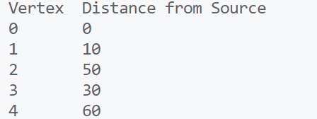

\setcounter{page}{87}

# PRACTICAL 31 -

Objective \- **Dijkstra's Algorithm (Shortest Path)**  
Implement Dijkstra’s algorithm to find shortest distances from a source node.

### CODE -
```c
#include <stdio.h>
#include <limits.h>
#include <stdbool.h>

#define MAX_NODES 5

// Function to find the vertex with the minimum distance value
int min_distance(int dist[], bool visited[], int numVertices) {
    int min = INT_MAX, min_index;

    for (int v = 0; v < numVertices; v++) {
        if (!visited[v] && dist[v] <= min) {
            min = dist[v];
            min_index = v;
        }
    }
    return min_index;
}

// Dijkstra's algorithm to find the shortest path
void dijkstra(int graph[MAX_NODES][MAX_NODES], int src, int numVertices) {
    int dist[MAX_NODES];      // Output array to hold the shortest distance from src to each vertex
    bool visited[MAX_NODES];  // Boolean array to track visited vertices

    // Initialize distances as infinite and visited[] as false
    for (int i = 0; i < numVertices; i++) {
        dist[i] = INT_MAX;
        visited[i] = false;
    }

    // Distance of source vertex to itself is always 0
    dist[src] = 0;

    // Find shortest path for all vertices
    for (int count = 0; count < numVertices - 1; count++) {
        // Pick the minimum distance vertex from the set of unvisited vertices
        int u = min_distance(dist, visited, numVertices);

        // Mark the picked vertex as visited
        visited[u] = true;

        // Update distance value of the adjacent vertices of the picked vertex
        for (int v = 0; v < numVertices; v++) {
            // Update dist[v] only if:
            // 1. It's not visited
            // 2. There's an edge from u to v (graph[u][v] > 0)
            // 3. Total weight of path from src to v through u is smaller than the current value of dist[v]
            if (!visited[v] && graph[u][v] && dist[u] != INT_MAX && dist[u] + graph[u][v] < dist[v]) {
                dist[v] = dist[u] + graph[u][v];
            }
        }
    }

    // Print the shortest distances
    printf("Vertex\tDistance from Source\n");
    for (int i = 0; i < numVertices; i++) {
        printf("%d\t%d\n", i, dist[i]);
    }
}

// Main function to demonstrate Dijkstra's Algorithm
int main() {
    int numVertices = 5;
    int graph[MAX_NODES][MAX_NODES] = {
        {0, 10, 0, 30, 100},
        {10, 0, 50, 0, 0},
        {0, 50, 0, 20, 10},
        {30, 0, 20, 0, 60},
        {100, 0, 10, 60, 0}
    };
    int source = 0; // Source vertex

    // Run Dijkstra's Algorithm
    dijkstra(graph, source, numVertices);

    return 0;
}
```

### OUTPUT -

