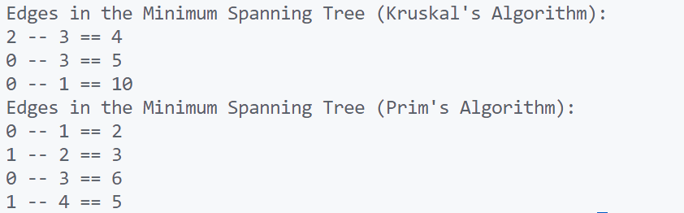

\setcounter{page}{90}

# PRACTICAL 32 -

Objective \- **Minimum Spanning Tree using Kruskal’s or Prim’s Algorithm**  
Construct a minimum spanning tree of a given weighted undirected graph.

### CODE -
```c
#include <stdio.h>
#include <stdlib.h>
#include <stdbool.h>

#define MAX_NODES 100
#define INF 999999

// Structure to represent an edge in the graph
typedef struct Edge {
    int src, dest, weight;
} Edge;

// Structure to represent a graph
typedef struct Graph {
    int numVertices, numEdges;
    Edge edges[MAX_NODES];
} Graph;

// Structure to represent a subset for Union-Find
typedef struct Subset {
    int parent;
    int rank;
} Subset;

// Function to create a new graph
Graph* create_graph(int numVertices, int numEdges) {
    Graph* graph = (Graph*)malloc(sizeof(Graph));
    graph->numVertices = numVertices;
    graph->numEdges = numEdges;
    return graph;
}

// Comparator function to sort edges by weight
int compare_edges(const void* a, const void* b) {
    Edge* edgeA = (Edge*)a;
    Edge* edgeB = (Edge*)b;
    return edgeA->weight - edgeB->weight;
}

// Find function for Union-Find
int find(Subset subsets[], int i) {
    if (subsets[i].parent != i) {
        subsets[i].parent = find(subsets, subsets[i].parent);
    }
    return subsets[i].parent;
}

// Union function for Union-Find
void union_subsets(Subset subsets[], int x, int y) {
    int rootX = find(subsets, x);
    int rootY = find(subsets, y);

    if (subsets[rootX].rank < subsets[rootY].rank) {
        subsets[rootX].parent = rootY;
    } else if (subsets[rootX].rank > subsets[rootY].rank) {
        subsets[rootY].parent = rootX;
    } else {
        subsets[rootY].parent = rootX;
        subsets[rootX].rank++;
    }
}

// Kruskal's Algorithm to find Minimum Spanning Tree
void kruskal_mst(Graph* graph) {
    int numVertices = graph->numVertices;
    Edge result[MAX_NODES]; // Array to store the resultant MST
    int resultIndex = 0;    // Index for result array

    // Step 1: Sort all edges in non-decreasing order of their weight
    qsort(graph->edges, graph->numEdges, sizeof(graph->edges[0]), compare_edges);

    // Allocate memory for Union-Find subsets
    Subset* subsets = (Subset*)malloc(numVertices * sizeof(Subset));
    for (int v = 0; v < numVertices; v++) {
        subsets[v].parent = v;
        subsets[v].rank = 0;
    }

    // Step 2: Pick the smallest edge and check if it forms a cycle
    for (int i = 0; i < graph->numEdges && resultIndex < numVertices - 1; i++) {
        Edge nextEdge = graph->edges[i];
        int x = find(subsets, nextEdge.src);
        int y = find(subsets, nextEdge.dest);

        // If including this edge does not form a cycle
        if (x != y) {
            result[resultIndex++] = nextEdge;
            union_subsets(subsets, x, y);
        }
    }

    // Print the resultant MST
    printf("Edges in the Minimum Spanning Tree (Kruskal's Algorithm):\n");
    for (int i = 0; i < resultIndex; i++) {
        printf("%d -- %d == %d\n", result[i].src, result[i].dest, result[i].weight);
    }

    free(subsets);
}

// Prim's Algorithm to find Minimum Spanning Tree
void prim_mst(int graph[MAX_NODES][MAX_NODES], int numVertices) {
    int parent[MAX_NODES]; // Array to store constructed MST
    int key[MAX_NODES];    // Key values used to pick minimum weight edge
    bool mstSet[MAX_NODES]; // To represent vertices included in MST

    // Initialize all keys as INFINITE
    for (int i = 0; i < numVertices; i++) {
        key[i] = INF;
        mstSet[i] = false;
    }

    // Always include the first vertex in MST
    key[0] = 0;
    parent[0] = -1; // First node is always the root of MST

    // MST construction
    for (int count = 0; count < numVertices - 1; count++) {
        // Find the minimum key vertex not yet included in MST
        int min = INF, minIndex;
        for (int v = 0; v < numVertices; v++) {
            if (!mstSet[v] && key[v] < min) {
                min = key[v];
                minIndex = v;
            }
        }

        // Add the picked vertex to the MST set
        int u = minIndex;
        mstSet[u] = true;

        // Update key and parent index of the adjacent vertices
        for (int v = 0; v < numVertices; v++) {
            if (graph[u][v] && !mstSet[v] && graph[u][v] < key[v]) {
                parent[v] = u;
                key[v] = graph[u][v];
            }
        }
    }

    // Print the constructed MST
    printf("Edges in the Minimum Spanning Tree (Prim's Algorithm):\n");
    for (int i = 1; i < numVertices; i++) {
        printf("%d -- %d == %d\n", parent[i], i, graph[i][parent[i]]);
    }
}

// Main function to demonstrate MST algorithms
int main() {
    // Example graph for Kruskal's Algorithm
    int numVerticesKruskal = 4;
    int numEdgesKruskal = 5;
    Graph* graph = create_graph(numVerticesKruskal, numEdgesKruskal);

    graph->edges[0] = (Edge){0, 1, 10};
    graph->edges[1] = (Edge){0, 2, 6};
    graph->edges[2] = (Edge){0, 3, 5};
    graph->edges[3] = (Edge){1, 3, 15};
    graph->edges[4] = (Edge){2, 3, 4};

    kruskal_mst(graph);

    // Example graph for Prim's Algorithm
    int numVerticesPrim = 5;
    int graphPrim[MAX_NODES][MAX_NODES] = {
        {0, 2, 0, 6, 0},
        {2, 0, 3, 8, 5},
        {0, 3, 0, 0, 7},
        {6, 8, 0, 0, 9},
        {0, 5, 7, 9, 0}
    };

    prim_mst(graphPrim, numVerticesPrim);

    free(graph);
    return 0;
}
```

### OUTPUT -

